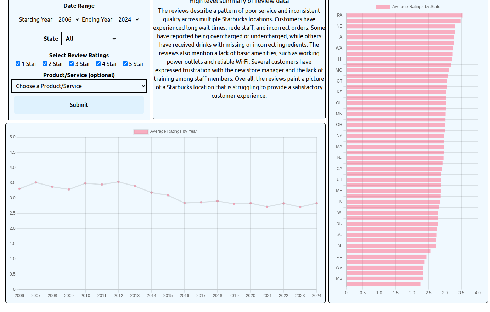

This is a project that extends on a previous data analysis project in which I analyzed sentiment trends of Starbucks by scraping and accumulating a database of tens of thousands of reviews of starbucks across the United States.
I decided to make a front-end interface with a LLM integration in which end users can querry the database and filter for time span, number of stars on ratings, any particular state, and several services and products.
What is returned is a summary of the reviews returned from the querry using the LLM.

The model used is the llama-3.1-8b-instant with an embedding from hugginface.

This is still a work in progress and I still have a lot of refactoring to do but it has been a fun to do so far.

You can test it out [here](https://project1.scottlynn.live) and let me know what you think.

